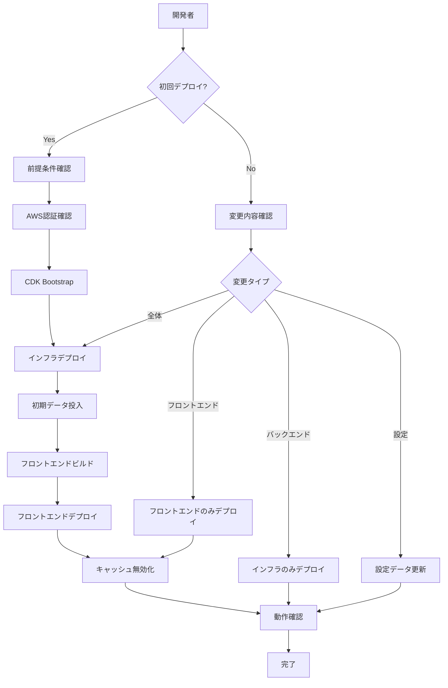

# デプロイプロセス設計書

## 概要

JAWS FESTA 2025 思い出アップロードプロジェクトのAWSデプロイプロセスの詳細設計。効率的で再現可能なデプロイフローを実現する。

## アーキテクチャ

### デプロイフロー図



## コンポーネント設計

### 1. 前提条件チェッカー

**目的**: デプロイ前の環境確認を自動化

**機能**:
- AWS CLI設定確認
- Node.js バージョン確認
- 必要な依存関係確認
- 設定ファイル検証

**実装場所**: `scripts/check-prerequisites.js`

### 2. 環境設定マネージャー

**目的**: 環境別設定の管理と切り替え

**機能**:
- 環境設定ファイル読み込み
- AWS プロファイル切り替え
- 環境変数設定
- 設定値検証

**設定ファイル構造**:
```json
{
  "stackName": "環境固有のスタック名",
  "environment": "dev|prod",
  "region": "ap-northeast-1",
  "account": "AWSアカウントID",
  "profile": "AWSプロファイル名",
  "cloudFrontDistributionId": "CloudFront Distribution ID"
}
```

### 3. デプロイオーケストレーター

**目的**: デプロイプロセス全体の制御

**機能**:
- デプロイタイプの判定
- 各ステップの実行制御
- エラーハンドリング
- 進行状況表示

**デプロイタイプ**:
- `full`: 完全デプロイ（初回）
- `infrastructure`: インフラのみ
- `frontend`: フロントエンドのみ
- `config`: 設定データのみ

### 4. インフラストラクチャデプロイヤー

**目的**: AWS CDKを使用したインフラデプロイ

**機能**:
- CDK Bootstrap実行
- スタックデプロイ
- 出力値取得
- リソース確認

**主要コマンド**:
```bash
npx cdk bootstrap
npx cdk deploy --require-approval never
```

### 5. フロントエンドデプロイヤー

**目的**: React アプリケーションのビルドとS3デプロイ

**機能**:
- Viteビルド実行
- S3バケットクリア
- ファイルアップロード
- MIMEタイプ設定

**ビルド出力**:
- `dist/index.html`
- `dist/assets/css/*.css`
- `dist/assets/js/*.js`

### 6. キャッシュマネージャー

**目的**: CloudFrontキャッシュの管理

**機能**:
- キャッシュ無効化実行
- 無効化状況確認
- 無効化履歴表示

**無効化パターン**:
- `/*`: 全ファイル
- `/index.html`: HTMLファイルのみ
- `/assets/*`: アセットファイルのみ

### 7. データマネージャー

**目的**: DynamoDB初期データの管理

**機能**:
- 設定データ投入
- データ存在確認
- 強制上書き
- データ表示

**初期データ構造**:
```json
{
  "PK": "CONFIG",
  "SK": "UPLOAD_CHECKLIST",
  "items": [
    {
      "id": "確認項目ID",
      "text": "確認項目テキスト",
      "required": true
    }
  ]
}
```

## エラーハンドリング設計

### 1. 依存関係エラー

**検出**: `npm list` コマンドでの確認
**対処**: 自動 `npm install` 実行
**メッセージ**: 「依存関係を再インストールしています...」

### 2. 権限エラー

**検出**: AWS API呼び出し時のエラー
**対処**: 必要権限の表示
**メッセージ**: 「以下の権限が必要です: [権限一覧]」

### 3. ファイルロックエラー

**検出**: EPERM エラー
**対処**: 代替手順の提案
**メッセージ**: 「ファイルが使用中です。手動でビルドしてください」

### 4. ネットワークエラー

**検出**: タイムアウト・接続エラー
**対処**: リトライ機能
**メッセージ**: 「接続を再試行しています... (X/3)」

## 監視とログ設計

### 1. 進行状況表示

**形式**: 絵文字付きステップ表示
```
🚀 デプロイを開始しています...
✅ AWS認証確認完了
🔨 インフラストラクチャをデプロイ中...
📦 フロントエンドをビルド中...
☁️ S3にアップロード中...
🔄 キャッシュを無効化中...
🎉 デプロイ完了！
```

### 2. 結果サマリー

**内容**:
- デプロイ時間
- 作成/更新されたリソース
- アクセスURL
- 次のステップ

### 3. ログ出力

**レベル**:
- `DEBUG`: 詳細な実行ログ
- `INFO`: 一般的な情報
- `WARN`: 警告メッセージ
- `ERROR`: エラーメッセージ

## セキュリティ設計

### 1. 認証情報管理

**原則**:
- AWS認証情報はファイルに保存しない
- 環境変数またはAWS CLIプロファイルを使用
- 最小権限の原則を適用

### 2. 設定ファイル保護

**対策**:
- 機密情報は設定ファイルに含めない
- `.gitignore`で適切に除外
- テンプレートファイルを提供

### 3. リソースアクセス制御

**設定**:
- S3バケットのパブリックアクセス制限
- API GatewayのCORS設定
- CloudFrontのアクセス制御

## パフォーマンス設計

### 1. 並列処理

**対象**:
- 複数ファイルのS3アップロード
- 依存関係のインストール
- ビルドプロセス

### 2. キャッシュ活用

**戦略**:
- npm キャッシュの活用
- CDK キャッシュの活用
- CloudFront キャッシュの最適化

### 3. 増分デプロイ

**実装**:
- 変更検出機能
- 部分デプロイ機能
- スキップ可能なステップ

## テスト設計

### 1. 単体テスト

**対象**:
- 設定ファイル読み込み
- 環境変数処理
- エラーハンドリング

### 2. 統合テスト

**対象**:
- デプロイフロー全体
- AWS サービス連携
- エラー復旧

### 3. 受け入れテスト

**対象**:
- 実際のAWS環境でのデプロイ
- ユーザーシナリオの実行
- パフォーマンス確認